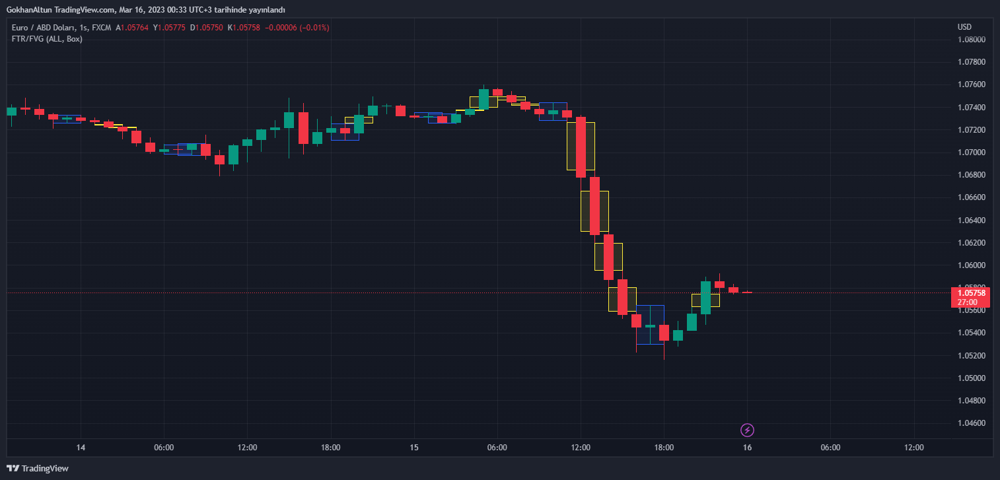
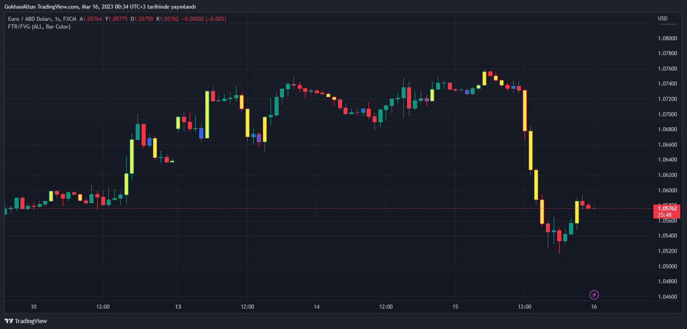

# FTR-FVG_Indicator_Pinescript
 FTR/FVG Indicator For TradingView (Pinescript)

### Warning Note:
 It is not for generating buy-sell signals.
 Making a trading decision with this indicator alone can have negative consequences!

 ### Screenshots:

  </img>
  </img>


 ### Code:
 ```js
// This source code is subject to the terms of the Mozilla Public License 2.0 at https://mozilla.org/MPL/2.0/
// © GokhanAltun

//@version=5
indicator("FTR/FVG", overlay = true, max_boxes_count = 500)

// === Groups ===
group_options = "Options"
group_ftr_color = "FTR Color Settings"
group_fvg_color = "FVG Color Settings"


// === Inputs ===
options = input.string("ALL", title = "Options", options = ["ALL", "FTR", "FVG"], group = group_options)
mark_type = input.string("Box", title = "Mark Type", options = ["ALL", "Box", "Bar Color"], group = group_options)
low_quality_ftr = input.bool(false, "Show Low Quality FTR", group = group_options)

ftr_border_color = input.color(color.blue, "Border Color", group = group_ftr_color)
ftr_bg_color = input.color(color.new(color.blue, 90), "Bg Color", group = group_ftr_color)
ftr_bar_color = input.color(color.blue, "Bar Color", group = group_ftr_color)

fvg_border_color = input.color(color.yellow, "Border Color", group = group_fvg_color)
fvg_bg_color = input.color(color.new(color.yellow, 90), "Bg Color", group = group_fvg_color)
fvg_bar_color = input.color(color.yellow, "Bar Color", group = group_fvg_color)


// === FTR ===
ftr_up = options != "FVG" and close < open and close[1] >= open[1] and close[2] < open[2] and close < close[2]
ftr_down = options != "FVG" and close > open and close[1] <= open[1] and close[2] > open[2] and close > close[2]

ftr_box_up = ftr_up and mark_type != "Bar Color" ? box.new(left = bar_index[2], top = high[1], right = bar_index, bottom = low[1], border_color = ftr_border_color, bgcolor = ftr_bg_color) : na
ftr_box_down = ftr_down and mark_type != "Bar Color" ? box.new(left = bar_index[2], top = high[1], right = bar_index, bottom = low[1], border_color = ftr_border_color, bgcolor = ftr_bg_color): na

barcolor(ftr_up and mark_type != "Box" ? ftr_bar_color : na, offset = -1)
barcolor(ftr_down and mark_type != "Box" ? ftr_bar_color : na, offset = -1)


// === Low Quality FTR ===
low_quality_ftr_up = options != "FVG" and low_quality_ftr and close < open and close[1] >= open[1] and close[2] < open[2]
low_quality_ftr_down = options != "FVG" and low_quality_ftr and  close > open and close[1] <= open[1] and close[2] > open[2]

low_quality_ftr_box_up = low_quality_ftr_up and mark_type != "Bar Color" ? box.new(left = bar_index[2], top = high[1], right = bar_index, bottom = low[1], border_color = ftr_border_color, bgcolor = ftr_bg_color) : na
low_quality_ftr_box_down = low_quality_ftr_down and mark_type != "Bar Color" ? box.new(left = bar_index[2], top = high[1], right = bar_index, bottom = low[1], border_color = ftr_border_color, bgcolor = ftr_bg_color): na

barcolor(low_quality_ftr_up and mark_type != "Box" ? ftr_bar_color : na, offset = -1)
barcolor(low_quality_ftr_down and mark_type != "Box" ? ftr_bar_color : na, offset = -1)


// === FVG ===
fvg_up_gap = options != "FTR" and close[1] > open[1] ? low - high[2] : 0.0
fvg_up_box = fvg_up_gap > 0 and mark_type != "Bar Color" ? box.new(left = bar_index[2], top = high[2], right = bar_index, bottom = low, border_color = fvg_border_color, bgcolor = fvg_bg_color) : na 

fvg_down_gap = options != "FTR" and close[1] < open[1] ? low[2] - high : 0.0
fvg_down_box = fvg_down_gap > 0 and mark_type != "Bar Color" ? box.new(left = bar_index[2], top = low[2], right = bar_index, bottom = high, border_color = fvg_border_color, bgcolor = fvg_bg_color) : na 

barcolor(fvg_up_gap > 0 and mark_type != "Box" ? fvg_bar_color : na, offset = -1)
barcolor(fvg_down_gap > 0 and mark_type != "Box" ? fvg_bar_color : na, offset = -1)

 ```